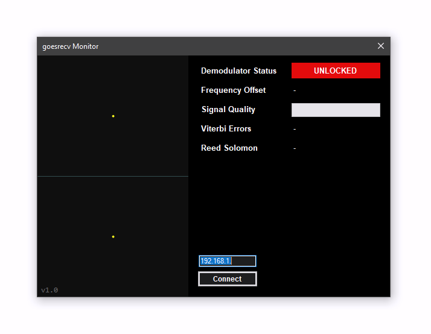

# goesrecv Monitor
goesrecv Monitor is a software utility for monitoring the status of [goesrecv](https://github.com/pietern/goestools) by [Pieter Noordhuis](https://twitter.com/pnoordhuis). goesrecv is a BPSK demodulator and CCSDS decoder for LRIT and HRIT downlinks transmitted by geostationary weather satellites like GOES-16/17 and GK-2A.



## Getting Started
Pre-built Windows executables can be found in [Releases](https://github.com/sam210723/goesrecv-monitor/releases/latest). Microsoft .NET Framework [v4.6.1](https://www.microsoft.com/en-au/download/details.aspx?id=49981) or later is required.

Open your ```goesrecv.conf``` file and confirm the following lines are not commented (remove ```#```), then restart goesrecv.
```
[clock_recovery.sample_publisher]
bind = "tcp://0.0.0.0:5002"
send_buffer = 2097152

[demodulator.stats_publisher]
bind = "tcp://0.0.0.0:6001"

[decoder.stats_publisher]
bind = "tcp://0.0.0.0:6002"
```

After downloading the latest ```goesrecv-monitor.zip```, extract all files and run ```goesrecv-monitor.exe```. Enter the IP address of a Raspberry Pi running goesrecv and click ```Connect``` (or hit enter). The constellation plot and statistics list will start showing data.
